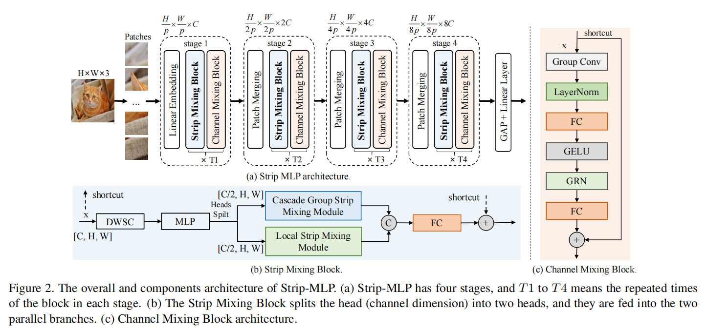
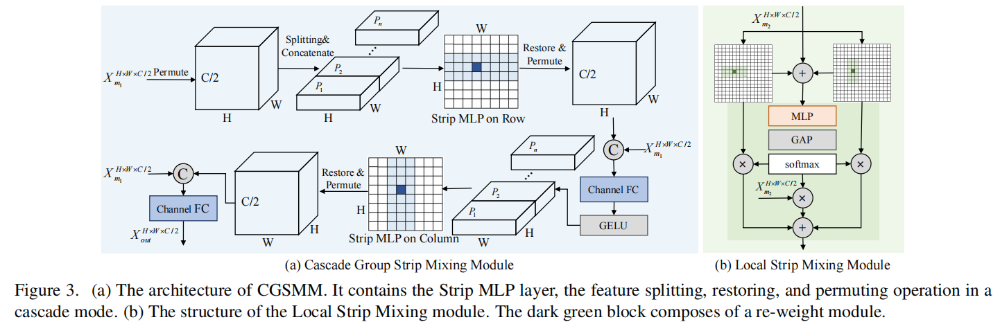
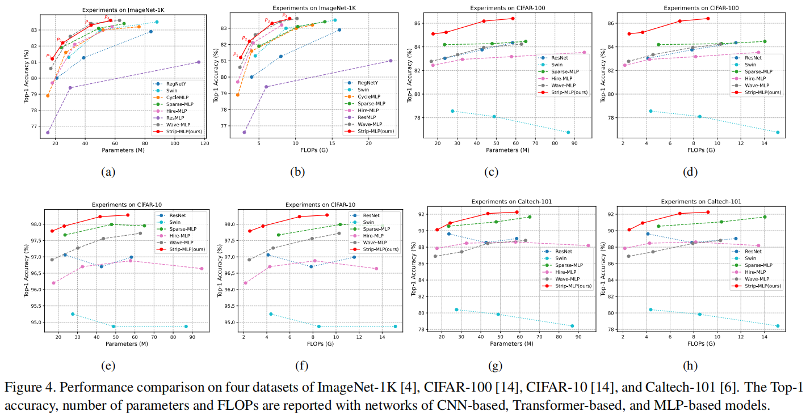

# Strip-MLP 

This is the official code (based on Pytorch framework) for the paper ["Strip-MLP: Efficient Token Interaction for Vision MLP"](https://arxiv.org/pdf/2307.11458.pdf). Strip-MLP is a general backbone for vision MLP with significantly superiorities on the performance and computing complexity of the model.


## Updates

***15/09/2023***

Initial commits: we release the source codes and the checkpoints on ImageNet-1K.

***07/14/2023***

`News`: Strip-MLP has been accepted to ICCV 2023!


## Introduction

We present **Strip-MLP** for deep MLP-based models to enrich the token interaction power in three ways.

1. Firstly, we introduce a new MLP paradigm called
Strip MLP layer that allows the token to interact with other
tokens in a **cross-strip** manner, enabling the tokens in a row (or column) to contribute to the information aggregations
in adjacent but different strips of rows (or columns).
2. Secondly, a **C**ascade **G**roup **S**trip **M**ixing **M**odule (CGSMM) is proposed to overcome the performance degradation caused by small spatial feature size. The module allows tokens to interact more effectively in the manners of within-patch and cross-patch, which is independent to the feature spatial size.
3. Finally, based on the Strip MLP layer, we propose a
novel **L**ocal **S**trip **M**ixing **M**odule (LSMM) to boost the token interaction power in the local region. Extensive experiments demonstrate that Strip-MLP significantly improves the performance of MLP-based models on small datasets and obtains comparable or even better results on ImageNet. In particular, Strip-MLP models achieve higher average Top-1 accuracy than existing MLP-based models by `+2.44%` on Caltech-101 and `+2.16%` on CIFAR-100.

## Methods

MLP-based models have *the Token's interaction dilemma* that 
the spatial feature resolution is down-sampled to a small size but with more channels, which means the feature pattern of each token is mainly concentrated on the channel dimension rather than the spatial one. 
Interacting tokens along the spatial dimension by
sharing the weights among all channels would seriously ignore the feature pattern differences among different channels, which may degrade the token interaction power, especially in deep layers with small spatial feature resolution.

To address these challenges, we propose a new efficient
Strip MLP model, dubbed **Strip-MLP**, to enrich the power
of the token interaction layer in three ways. For the level
of a single MLP layer, inspired by the cross-block normalization schemes of HOG and the sparse connections between the biological neurons, we design a Strip MLP layer
to allow the token to interact with other tokens in a cross -strip manner, enabling each row or column of the tokens
to contribute differently to other rows or columns. For the
token interaction module level, we develop channel-wise
group mixing of CGSMM, enabling the tokens in a row (or
column) to contribute to the information aggregations in adjacent but different strips of rows (or columns). to tackle the
problem that the token interaction power decreases in deep
layers with the spatial feature size significantly reduced but with multiplying channels. Considering the existing methods interact the tokens mainly in the long range
of row (or column), which may not aggregate tokens well
in the local region, we propose a new Local Strip Mixing
Module (LSMM) with a small Strip MLP unit to strengthen
the token interaction power on local interactions.








## Main Results on ImageNet

**Results on ImageNet-1K**

| Model | Dataset | Resolution |Acc@1 | Acc@5 | #Params | FLOPs | FPS| Checkpoint |
| :---: | :---: | :---: | :---: | :---: | :---: | :---: | :---: |:---: |
| Strip-MLP-T* | ImageNet-1K | 224x224 | 81.2 | 95.6 | 18M | 2.5G | 814 | [Baidu](https://pan.baidu.com/s/15SQy1MxY5RQlybNVpuFQcg?pwd=1234) |
| Strip-MLP-T | ImageNet-1K | 224x224 | 82.2 | 96.1 | 25M | 3.7G | 597 | [Baidu](https://pan.baidu.com/s/1mUDavm3Y8pmW8p7QmypnNQ?pwd=1234) |
| Strip-MLP-S | ImageNet-1K | 224x224 | 83.3 | 96.6 | 43M | 6.8G | 381 | [Baidu](https://pan.baidu.com/s/1uXoPzrhptbA8FBuQcaOrVg?pwd=1234) |
| Strip-MLP-B | ImageNet-1K | 224x224 | 83.6 | 96.5 | 57M | 9.2G | 300 | [Baidu](https://pan.baidu.com/s/1t4iQuMqUR8yfAO0kRS1EFg?pwd=1234) |


## Citing Strip-MLP

```
@article{cao2023strip,
  title={Strip-MLP: Efficient Token Interaction for Vision MLP},
  author={Cao, Guiping and Luo, Shengda and Huang, Wenjian and Lan, Xiangyuan and Jiang, Dongmei and Wang, Yaowei and Zhang, Jianguo},
  journal={International Conference on Computer Vision (ICCV)},
  year={2023}
}
```


## Data preparation of ImageNet-1K 

Download and extract ImageNet train and val images from http://image-net.org/. 
The directory structure is the standard layout for the torchvision [`datasets.ImageFolder`](https://pytorch.org/docs/stable/torchvision/datasets.html#imagefolder). 
The directory structure is:

```
│path/to/imagenet/
├──train/
│  ├── n01530575
│  │   ├── n01530575_188.JPEG
│  │   ├── n01530575_190.JPEG
│  │   ├── ...
│  ├── ...
├──val/
│  ├── n01514668
│  │   ├── ILSVRC2012_val_00011403.JPEG
│  │   ├── ILSVRC2012_val_00012484.JPEG
│  │   ├── ...
│  ├── ...
```
The datasets of CIFAR-10 and CIFAR-100 can be download automatically for the torchvision [`torchvision.datasets.CIFAR10`] [`torchvision.datasets.CIFAR100`].

## Data preparation of Caltech-101 

Download the dataset from [`Caltech-101`]('https://data.caltech.edu/records/mzrjq-6wc02'). We split the
raw data into training dataset and testing dataset randomly. Here, we provide our code of dataset spliting (seeing the file [`categories101_train_val_split.py`]), which splits the 80% of each class of the data as the training set and the remaining data as the testing set. We set a fixed number, like [`1024`], as the seed in the program, so that the data spliting method can be reproduced.


## Train Strip-MLP

To train the Strip-MLP-Base on ImageNet-1K:

```
python -m torch.distributed.launch --nproc_per_node 1 --master_port 12345  main.py --cfg configs/smlp_base_alpha3_patch4_224_imagenet1k.yaml --data-path <imagenet22k-path> --batch-size 128

```

## Evaluate Strip-MLP

To evaluate the Strip-MLP-Base on ImageNet-1K:

```
python -m torch.distributed.launch --nproc_per_node 1 --master_port 12345  main_eval.py --cfg configs/smlp_base_alpha3_patch4_224_imagenet1k.yaml --data-path <imagenet22k-path> --batch-size 128
```

## License

[](https://opensource.org/licenses/MIT)


## Acknowledgement

Our source codes are built on top of [Swin-Transformer](https://github.com/microsoft/Swin-Transformer) and [SPACH](https://github.com/microsoft/SPACH).
